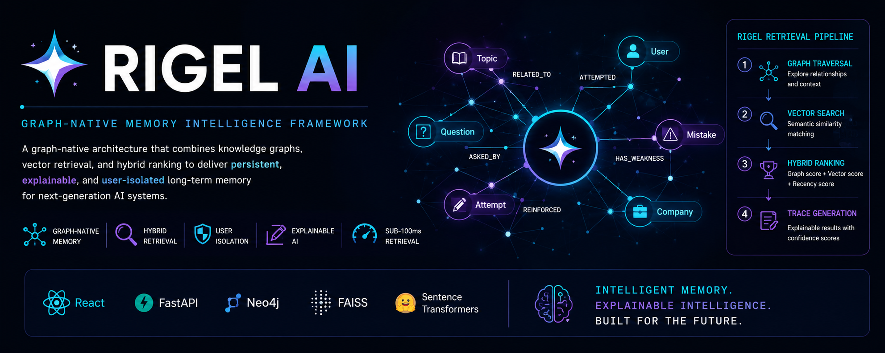

  

# Rigel AI

### Graph-Native Memory Intelligence Framework

Rigel AI is a graph-native memory architecture designed to provide persistent, explainable, and user-isolated long-term memory for next-generation AI systems.

By combining knowledge graphs, vector retrieval, and hybrid ranking techniques, Rigel enables intelligent systems to retain context, reinforce learning, explain retrieval decisions, and support transparent reasoning across long-term interactions.

---

## Project Status

🚧 Research & Architecture Phase

Rigel AI is currently under active research and system design.

This repository serves as the public documentation hub for the architecture, memory model, retrieval engine, and future roadmap of the project.

---

## The Problem

Modern AI systems suffer from several fundamental limitations:

- Context loss across sessions
- Stateless interactions
- Lack of structured memory
- Limited explainability
- Poor retrieval transparency
- Weak user-specific memory management

As a result, AI systems often fail to develop persistent contextual understanding and cannot clearly explain why information was retrieved.

---

## The Rigel Approach

Rigel introduces a graph-native memory framework that combines:

- Knowledge Graphs
- Vector Retrieval
- Hybrid Ranking
- Retrieval Traceability
- User-Isolated Memory Spaces

This architecture enables explainable and persistent memory operations for AI systems.

---

## Core Innovations

### Graph-Based Memory

Knowledge is stored as interconnected entities and relationships rather than isolated text chunks.

### Hybrid Retrieval

Retrieval combines:

- Graph Traversal
- Vector Similarity Search
- Recency Scoring

### Explainable AI

Every retrieval operation can be traced through graph paths and ranking explanations.

### User Isolation

Each user operates within an independent memory namespace.

### Performance Monitoring

Retrieval performance is measured independently from LLM generation.

---

## System Architecture

### Frontend Layer

- React Interface
- Interactive Mind Map
- Retrieval Trace Viewer

### Memory Engine

- FastAPI
- Memory Ingestion
- Hybrid Ranking
- User Isolation Enforcement

### Memory Infrastructure

- Neo4j Graph Database
- FAISS Vector Index

### Retrieval Layer

- Graph Traversal
- Semantic Search
- Hybrid Ranking Engine

### Explainability Layer

- Retrieval Trace Generation
- Confidence Scoring
- Path Visualization

---

## Documentation

| Document | Description |
|-----------|------------|
| vision.md | Project vision and mission |
| architecture.md | System architecture |
| memory-model.md | Graph memory schema |
| retrieval-engine.md | Hybrid retrieval framework |
| roadmap.md | Development roadmap |
| technology-stack.md | Technology architecture |

---

## Memory Model

Rigel stores information through interconnected graph structures.

Core Nodes:

- User
- Topic
- Question
- Attempt
- Mistake
- Company

Each node contains metadata including:

- Timestamp
- Confidence Score
- Reinforcement Score
- Source Type

---

## Retrieval Pipeline

Query

↓

Graph Traversal

↓

Vector Similarity Search

↓

Hybrid Ranking

↓

Memory Trace Generation

↓

Explainable Retrieval

---

## Technology Stack

### Frontend

- React
- Interactive Mind Maps

### Backend

- Python
- FastAPI

### Graph Layer

- Neo4j

### Vector Layer

- FAISS

### Embedding Layer

- Sentence Transformers

---

## Development Roadmap

### Phase 1

Memory Foundation

### Phase 2

Graph Memory Engine

### Phase 3

Hybrid Retrieval Engine

### Phase 4

Explainability Layer

### Phase 5

Performance Optimization

### Phase 6

Memory Intelligence Engine

### Phase 7

Multi-Agent Memory Systems

---

## Potential Applications

Rigel AI is designed for:

- AI Assistants
- Educational Platforms
- Healthcare Systems
- Enterprise Knowledge Bases
- Research Intelligence Platforms
- Decision Support Systems

---

## Future Research Areas

- Graph Neural Networks
- Knowledge Graph Reasoning
- Federated Memory Systems
- Multi-Agent Memory
- Reinforcement-Based Memory Evolution
- Explainable Retrieval Frameworks

---

## Author

### Vishwajeet Nande

Founder, Inovexia AI Technologies

Research Interests:

Artificial Intelligence • Knowledge Graphs • Explainable AI • Retrieval Systems • Human-AI Collaboration • Decision Intelligence

---

## Disclaimer

Rigel AI is a research and development initiative.

The architecture described within this repository represents an evolving framework intended for experimentation, exploration, and future implementation.
